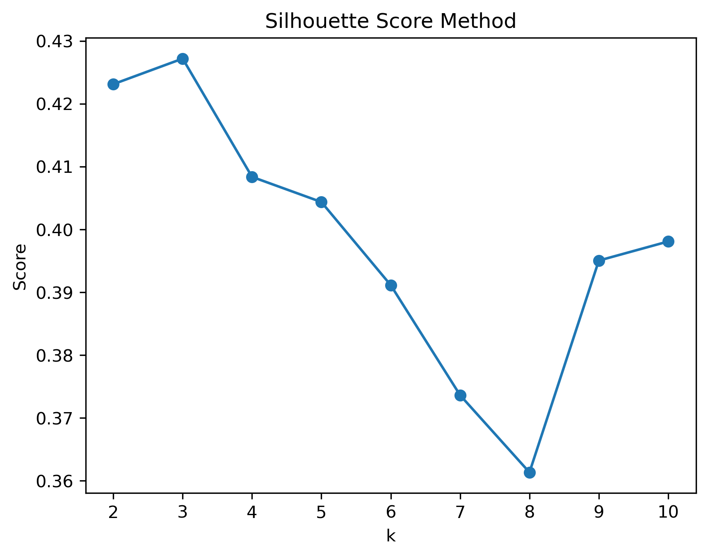
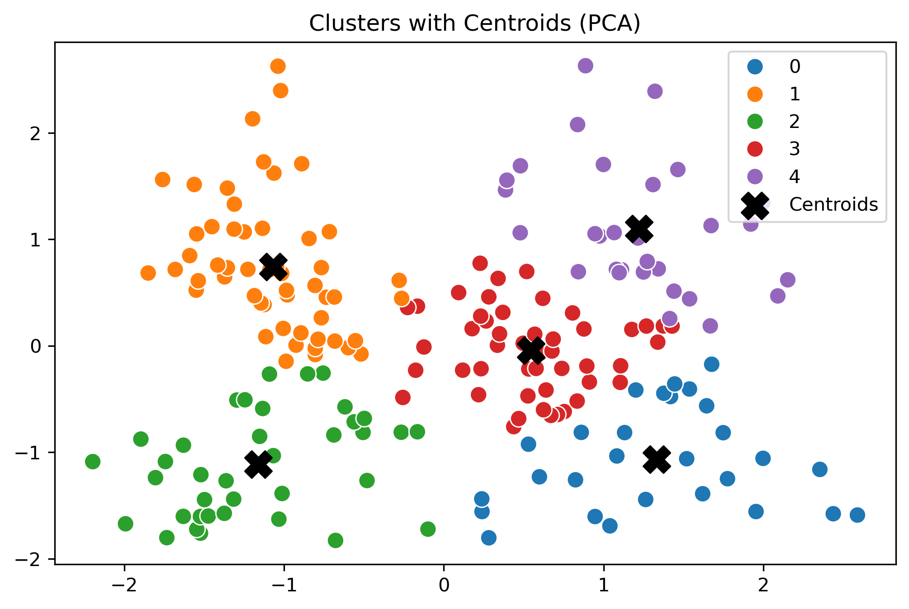
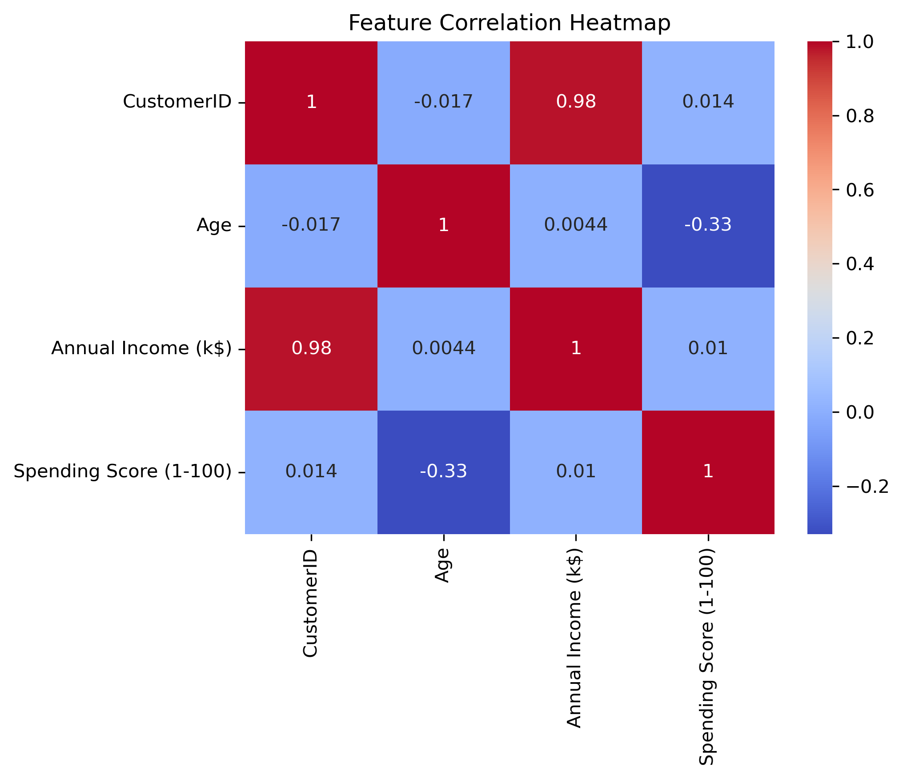
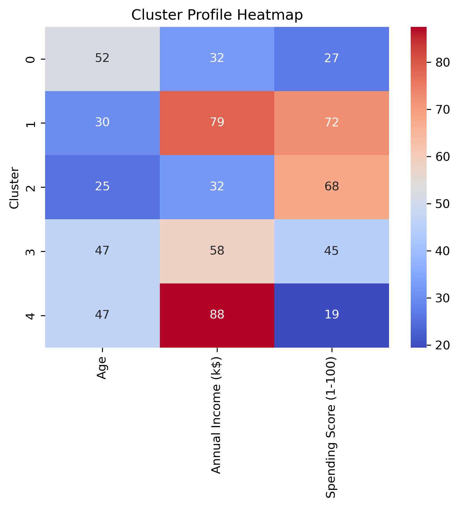

# Customer Segmentation using K-Means Clustering

This project applies K-Means Clustering to segment customers based on their age, income, and spending behavior, helping businesses identify distinct groups for targeted marketing and strategy optimization.

## Overview
Using the Mall Customers dataset, this project groups customers into clusters, visualizes them using PCA, and provides actionable insights for business decisions.

## Tech Stack
- **Language:** Python 3
- **Libraries:** Pandas, NumPy, Scikit-learn, Matplotlib, Seaborn
- **Algorithm:** K-Means Clustering
- **Visualization:** PCA (Principal Component Analysis)

## Dataset
**Source:** Mall Customer Segmentation Dataset from Kaggle

## Description
The dataset contains customer demographic and spending data:
- CustomerID, Gender, Age, Annual Income (k$), Spending Score (1-100)

## Project Workflow
1. **Data Cleaning & Preprocessing:** Handle missing values, encode categorical data
2. **Feature Scaling & Selection:** Standardize Age, Annual Income, and Spending Score
3. **Model Building:** Apply K-Means, determine optimal clusters using Elbow and Silhouette Score methods
4. **Dimensionality Reduction:** Use PCA for 2D visualization
5. **Visualization & Insights:** Interpret cluster patterns and correlations

##  Visualizations  
###  Silhouette Score Method  
Helps determine the optimal number of clusters.  
  

### Customer Clusters with Centroids  
Shows customer groups identified using K-Means.  
  

### Feature Correlation Heatmap  
Displays relationships between age, income, and spending.  
  

### Cluster Profile Heatmap  
Summarizes average feature values for each customer cluster.  
  

## Key Insights
- Younger customers tend to have higher spending scores
- Annual income doesn't always correlate with spending
- Distinct segments include budget shoppers, moderate spenders, and premium customers
- Businesses can tailor marketing strategies for each cluster

## Author
**Bhagyavansh Sethi**  
Email: sethibhagyavansh@gmail.com  
LinkedIn: [Your LinkedIn Profile]

